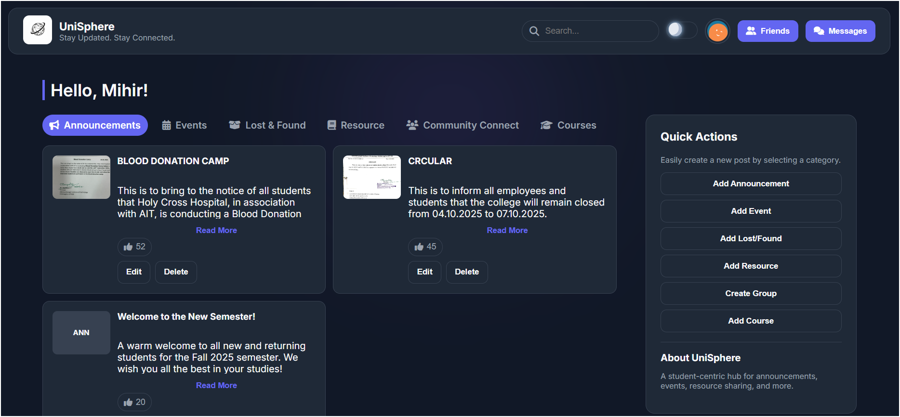

# UniSphere: Your University's Digital Campus Hub

**UniSphere is a modern, feature-rich web application designed to connect students and faculty, making university life more organized, engaging, and collaborative.**



## ✨ Core Features

This project was built from the ground up to provide a comprehensive digital ecosystem for students. The key features include:

* **Announcements & Events:** A central place for official college announcements and upcoming events, with special posting privileges for administrators.
* **Lost & Found:** A dedicated, filterable section for students to post about lost or found items, helping reunite owners with their belongings.
* **Resource Sharing:** A collaborative space for students to upload and share lecture notes, textbooks, and project code, neatly organized by category.
* **Real-time Messaging:** A built-in, private chat system that allows students to connect and communicate with their friends instantly.
* **Friends & Community:** A complete social system where students can send, receive, and manage friend requests to build their campus network.
* **User Profiles:** Secure, customizable user profiles with personalized avatars.
* **Role-Based Access Control:** A clear distinction between 'Admin' and 'Student' roles, ensuring that official posts can only be made by authorized staff.
* **Modern UI/UX:** A clean, responsive interface with a light/dark mode theme toggle for a comfortable user experience.

## 🛠️ Technology & Architecture

UniSphere is a full-stack application built with a focus on security, maintainability, and modern development practices.

* **Frontend:** HTML, CSS, and **Vanilla JavaScript (ES6 Modules)**. The frontend is modular, with separate components for handling posts, chat, authentication, and UI, ensuring the code is clean and scalable.
* **Backend:** **PHP** with a RESTful API structure. The backend logic is organized into separate, feature-specific endpoints (e.g., `posts.php`, `friends.php`, `messages.php`) to avoid monolithic code and improve maintainability.
* **Database:** **MySQL**.
* **Security:** The application uses prepared statements to prevent SQL injection and securely stores credentials using a `.env` file, following industry best practices.

---

## 🚀 Local Setup (For Developers)

<details>
  <summary>Click to expand instructions for running the project locally.</summary>

  ### 1. Prerequisites
  * A local web server environment (e.g., [XAMPP](https://www.apachefriends.org/index.html)).
  * MySQL database and PHP.

  ### 2. Clone the Repository
  Clone this project into the `htdocs` directory of your local server.
  ```bash
  git clone <https://github.com/cybersleuth25/UniSphere.git> unisphere
  cd unisphere2